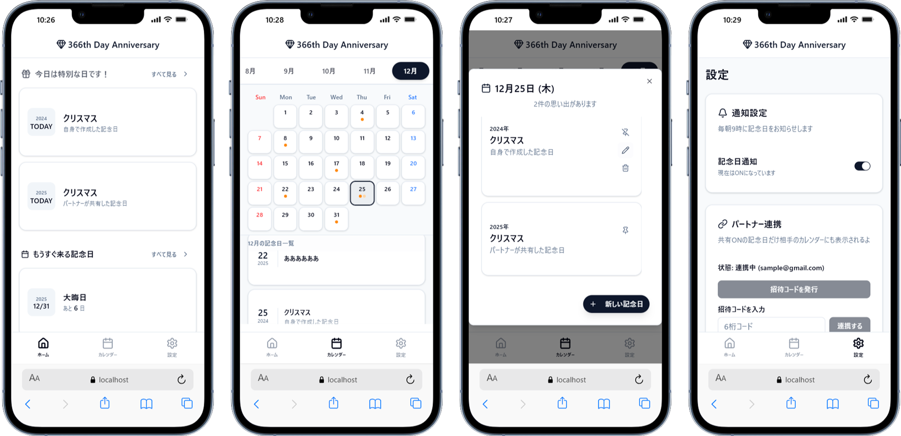

## Service Overview
This is a simple but powerful calendar app for remembering important anniversaries. It solves problems like "How many days has it been since that day?" or "When is our next anniversary?"

It works as a PWA, so you can add it to your phone's home screen and use it like a real app. Every morning at 9:00, it sends a push notification about today's anniversary, so you never miss an important day.

## Why I Made This

I was looking for an app to track anniversaries with my partner, but I couldn't find one that fit what I wanted.
So I decided to build my own.
My partner and I still use it together today.

## AI-Driven Development Flow

In this project, I used AI (Gemini) through the whole process.

1. **Writing the specs** — I talked with the AI to create the requirements, design docs, and steps for development
2. **Coding cycle** — I coded step by step following the AI's advice, and debugged bugs together with the AI
3. **Handling spec changes** — For any change, I first updated the docs, then updated the code

I felt that keeping the docs as a "single source of truth" helped me keep the specs consistent, even in solo development.

## Why I Chose These Technologies

### Next.js + TypeScript
Since I planned to use AI coding and a NoSQL database, I wanted a type-safe setup.
It also works well with Vercel deploys.

### Firebase
This serverless setup was a good match for fast, solo development.
I liked that I could build a real-time database without needing a relational database.

### PWA
I chose PWA to add push notifications and to give users an app-like experience without needing to install anything.

### Vercel Cron Jobs
Two years ago, at a hackathon, I failed to set up FCM (push notifications) correctly.
This time, I chose a design that keeps the scheduled job and the notification sending separate.
I picked this because it was simple to set up, and I wanted to try something new.

### Tailwind CSS + shadcn/ui
I used these libraries to build faster. I had never used shadcn/ui before, so I chose it on purpose, to learn something new.

## Problems I Faced

### A deadline I set myself
I told my partner, "I'll show you in one week," so I had to finish fast.
I made a clear list of which features mattered most, built a simple working version (MVP) first, and then kept improving it.

### Building push notifications
I had failed at this before, at a hackathon, so I planned the tech choices carefully this time (see "Why I Chose These Technologies").
This time it worked well, and I could use what I learned from my past failure.

### Limited context in AI tools
I used Gemini's chat instead of GitHub Copilot, so I couldn't share the whole repo as context.
I worked around this by pasting the code I needed each time.
