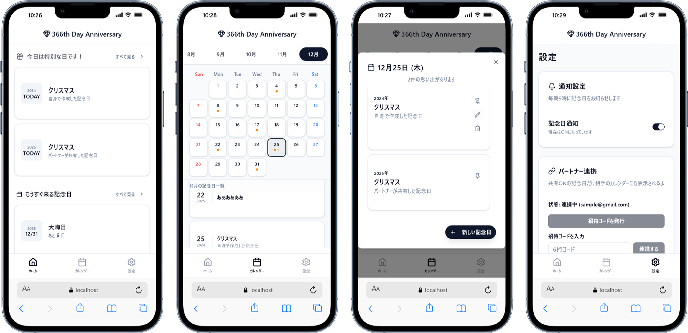

## サービス概要
大切な記念日を忘れないための、シンプルで強力なカレンダーアプリです。 「あの日から何日経ったっけ？」「次の記念日はいつだっけ？」という悩みを解消します。

PWAに対応しているため、スマホのホーム画面に追加してアプリのように利用できます。また、毎朝9:00に当日の記念日をプッシュ通知でお知らせするため、大切な日を見逃すことがありません。

## 開発の思い

パートナーとの記念日を管理するサービスを探していたものの、
理想に合うアプリが見つからなかったため、自作することにしました。
現在もパートナーと2人で実際に使い続けています。

## AI駆動の開発フロー

このプロジェクトでは、開発全体を通じてAI（Gemini）を活用しました。

1. **仕様の言語化** — 要件定義・設計仕様書・開発手順をAIとの壁打ちで作成
2. **実装サイクル** — AIの指示に沿って実装を進め、バグはAIと一緒にデバッグ
3. **仕様変更への対応** — 変更はまずドキュメントの更新から始め、コードに反映

ドキュメントを「単一の真実」として管理するこのフローは、
個人開発でも仕様の一貫性を保つ上で有効だと感じました。

## 技術選定の理由

### Next.js + TypeScript
AIコーディングおよびNoSQL使用を前提に、型安全な開発環境を優先。
Vercelとのデプロイ親和性も選定理由のひとつ。

### Firebase
スピード優先の個人開発にマッチしたサーバーレス構成。
RDB不要でリアルタイムDBを組める点を評価。

### PWA
プッシュ通知の実装と、インストール不要でネイティブアプリに近いUXを実現するために採用。

### Vercel Cron Jobs
2年前のハッカソンでFCMの実装に失敗した経験から、今回は定時実行と通知配信を分離する設計を選択。
設定のシンプルさと未経験技術への挑戦を兼ねて採用。

### TailwindCSS + shadcn/ui
開発速度を優先し既存ライブラリを採用。
shadcn/uiは未経験だったためあえて選定し、知見を積む機会とした。

## 開発で直面したこと

### 自己申告の納期
パートナーに「1週間後に見せる」と宣言してしまったため、短期間での完成が必須でした。機能の優先順位を明確にし、MVP（最低限動くもの）を先に完成させてから改善を重ねる進め方で乗り切りました。

### プッシュ通知の実装
過去のハッカソンで同様の実装に失敗した経験があったため、技術選定の段階から慎重に設計を検討しました。（技術選定参照）
結果として今回は問題なく実装でき、過去の失敗を活かせた部分でもあります。

### AIツールのコンテキスト制約
GitHub Copilotを使わずGeminiのチャット形式で開発したため、リポジトリ全体をコンテキストとして渡せない制約がありました。
必要なコードを都度貼り付けながら進めることでカバーしました。
