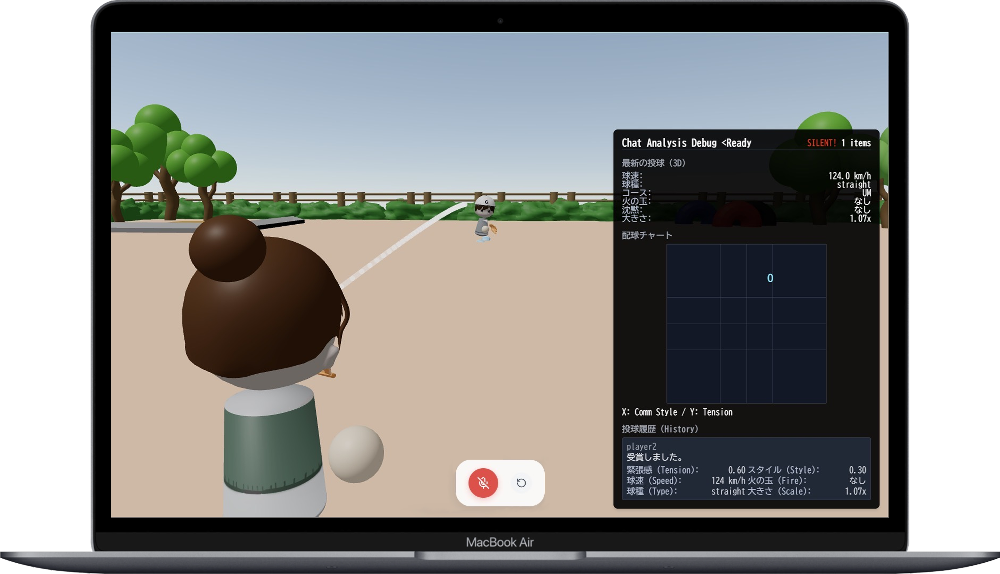
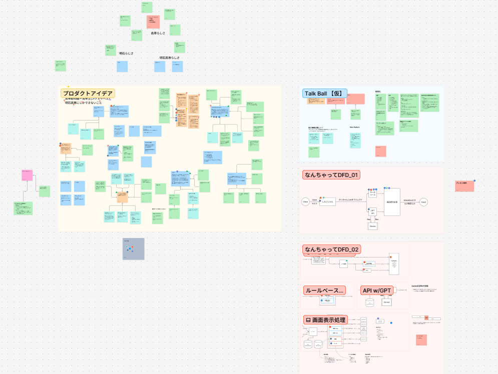
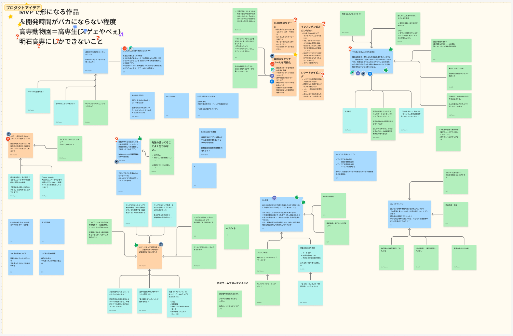
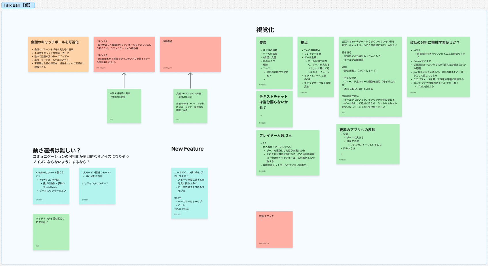
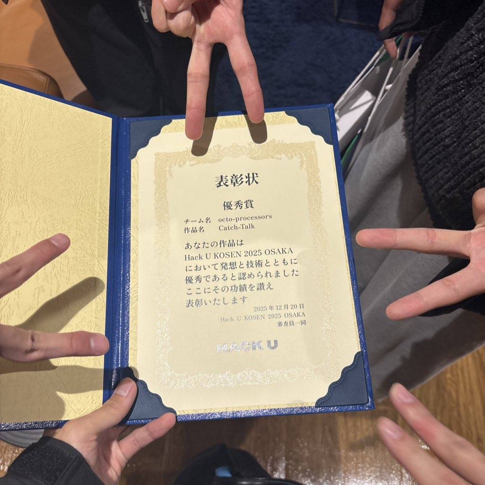

## Service Overview

This is a web app that listens to a conversation between two people in real time, and shows their words as a "pitch" in a 3D animation.

It picks up voice from two microphones, turns speech into text for each speaker, then uses Gemini and rule-based logic to turn that speech into a pitch type, speed, and location. Three.js shows a 3D ball being thrown across a park field, so you can see the flow of the conversation as a "pitch chart."

**Won the Judges' Award at HACK U KOSEN 2025 OSAKA.**

[https://hacku.yahoo.co.jp/kosen2025/](https://hacku.yahoo.co.jp/kosen2025/)

## Why I Made This

HACK U KOSEN 2025 OSAKA was a hackathon with about two weeks to build.

My team used FigJam to brainstorm many ideas, and we came to one idea: "Kosen students are great at talking about games or their specialty, but not so good at everyday small talk — the back-and-forth of a conversation."

From there, we came up with the metaphor "catch ball of conversation," and the idea to visualize it. We had many ideas, but choosing the one concept the whole team really believed in was, I think, a big reason we won the award.

We kept building and preparing until just before the presentation, and winning the award felt like a big achievement for the whole team.

## My Role in the Team

Our team had 5 people. I mainly worked on the idea and design stage.

- **Idea and concept** — Led the FigJam brainstorm and helped the team land on the "visualize the conversation catch-ball" concept
- **Concept design** — Designed how speech turns into pitch type, speed, and location (X-axis: logic vs. empathy, Y-axis: high vs. low energy)
- **System design** — Led the DFD, data flow design, and type definitions, discussing them with the team. Managed the design diagrams in FigJam and shared them with everyone

## How the Product Works

It looks at two sides of speech — "content" and "energy" — and turns them into pitch type, speed, and location.

| Feature of speech | Turns into |
|---|---|
| Speed / energy of talking | **Pitch speed** (e.g. fast talking → high speed) |
| High or low energy | **Y-axis of location** (high → higher, low → lower) |
| Logical or emotional way of talking | **X-axis of location** (logic ↔ empathy) |
| Content and context of speech | **Pitch type** (straight, curve, slider, etc.) |

## Why I Chose These Technologies

### Google Cloud Speech-to-Text
We also thought about the Web Speech API, but we had accuracy problems with it in a past project, so we didn't use it.
We compared Deepgram and Google Cloud STT, and chose Google Cloud for its accuracy and stability with Japanese speech.

### Gemini API + rule-based logic together
We used Gemini to decide the pitch type and location. By passing the conversation history as an array, the AI could use context in its analysis. But an LLM alone can't always give stable numbers (like pitch speed), so we used rule-based logic to fill that gap.

### Three.js + Blender
Each pitch type follows a different path, made with Bezier curves. We made the park background, characters, and ball in Blender, and showed them with Three.js.

### Jotai
We used this to manage voice, text history, and analysis results separately, since they each have a different lifecycle. My experience moving [Tameike GO!](https://miruomo.com/?work=tameikego#works) from Recoil to Jotai helped here.

## Design Choices I Care About

### Making the idea sharp
Instead of just saying "we visualize conversation," we used one clear baseball metaphor — pitch type, speed, location, and pitch chart — all the way through. This made the product easy to understand, even at the exhibition. Spending time to make the idea clear helped with the coding, the presentation, and the award.

### Sharing the design with a DFD
Before coding, we drew a DFD (Data Flow Diagram) in FigJam, so the whole team understood how data would move before we started. This discussion also led to the design where voice, text, and analysis results are separate objects, linked by an ID.

## Award

**HACK U KOSEN 2025 OSAKA Judges' Award** (December 20, 2025)

