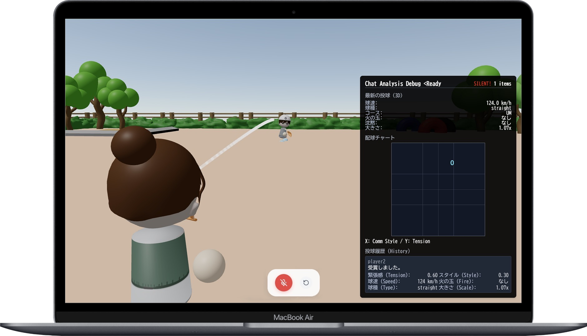
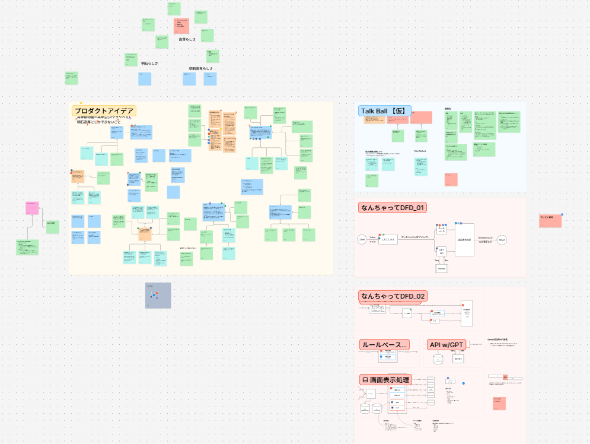
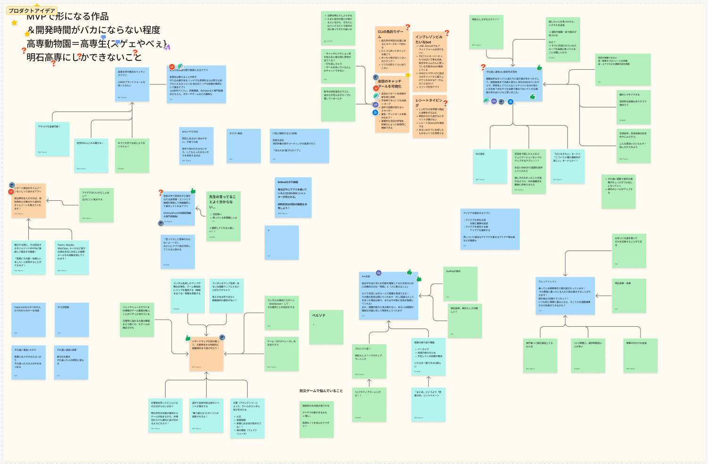
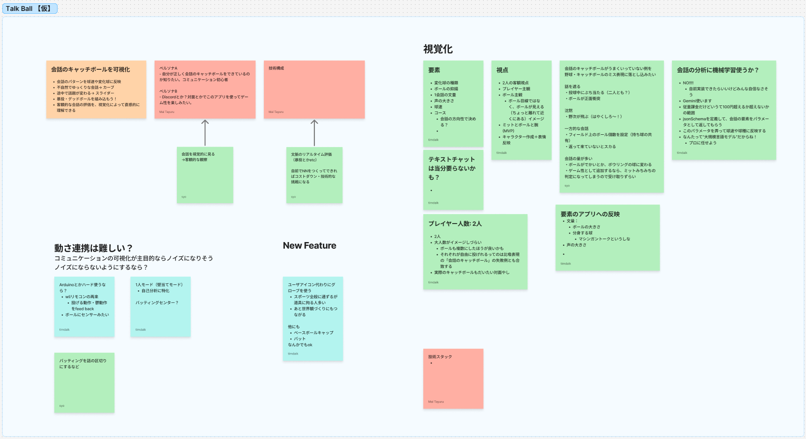
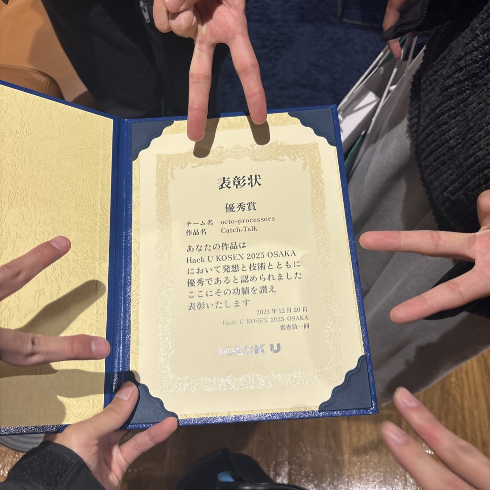

## サービス概要

2人の会話をリアルタイムで音声認識し、その発話を「投球」に見立てて3Dアニメーションで可視化するWebアプリです。

マイク2本から話者ごとに音声を取得・文字起こしし、GeminiとルールベースによるAI分析でその発話を球種・球速・コースにマッピング。Three.jsで3Dボールが公園グラウンドを投球されるアニメーションとして表示し、会話の流れを「配球チャート」として可視化します。

**HACK U KOSEN 2025 OSAKAにて優秀賞（審査員賞）を受賞。**

[https://hacku.yahoo.co.jp/kosen2025/](https://hacku.yahoo.co.jp/kosen2025/)

## 開発の思い

HACK U KOSEN 2025 OSAKAは約2週間の開発期間のハッカソンでした。

チームでFigJamを使ってアイデアを発散させた結果、ある観察に行き着きました。「高専生はゲームや専門の話はとても得意だが、日常会話のキャッチボールが苦手な傾向がある」というものです。

そこから「会話のキャッチボール」というメタファーが生まれ、「可視化してしまおう」というコンセプトに収束しました。多くのアイデアが出た中で、チームが「これだ」と納得できるコンセプトに絞り込んだことが、受賞につながった大きな要因だったと感じています。

発表前日ギリギリまで開発・発表準備を続け、最終的に優秀賞を受賞できたことはチーム全員にとって大きな達成感となりました。

## チームと自分の役割

5人チームで、自分はアイデア出しと設計フェーズを主に担当しました。

- **アイデア発案・収束** — FigJamでの発散を主導し「会話のキャッチボール可視化」というコンセプトに収束
- **コンセプト設計** — 発話を球種・球速・コースに変換するマッピング設計（X軸：合理性↔共感性、Y軸：テンション高低）を考案
- **システム設計** — DFD・データフロー設計・型定義をチームで議論しながら主導。FigJamで設計図を管理しチームで共有

## プロダクトの仕組み

発話の「内容」と「勢い」を2軸で分析し、球種・球速・コースに変換します。

| 発話の特徴 | 変換先 |
|---|---|
| 話す速さ・テンション | **球速**（例：早口 → 高球速） |
| テンションの高低 | **コースのY軸**（高い → 高め、低い → 低め） |
| 合理的な話し方か共感的な話し方か | **コースのX軸**（合理性 ↔ 共感性） |
| 発話の内容・文脈 | **球種**（ストレート・カーブ・スライダーなど） |

## 技術選定の理由

### Google Cloud Speech-to-Text
Web Speech APIも候補に上がりましたが、過去プロジェクトでの精度の問題から採用を見送り。
DeepgramとGoogle Cloud STTを比較検討した結果、日本語認識精度と安定性を優先してGoogle Cloudを採用しました。

### Gemini API + ルールベース処理の併用
発話の球種・コース判定にGeminiを採用。会話履歴を配列で渡すことで文脈を活かした分析を実現しました。ただしLLMだけでは出力の安定性が担保しにくい部分（球速などの定量的な指標）はルールベース処理で補完する設計にしています。

### Three.js + Blender
球種ごとに異なる軌道をベジェ曲線で数式表現。公園の背景・キャラクター・ボールはBlenderで制作しThree.jsで表示させています。

### Jotai
音声・テキスト履歴・分析結果という異なるライフサイクルのデータを分離管理するために採用。[ため池GO!](https://miruomo.com/?work=tameikego#works)でのRecoil→Jotai移行の経験が活きました。

## 設計上のこだわり

### 「何を作るか」の解像度
単に「会話を可視化する」ではなく、球種・球速・コース・配球チャートという野球のメタファーを一貫して使うことで、展示会でも直感的に伝わるプロダクトになりました。コンセプトの言語化に時間をかけたことが、実装・発表・受賞すべてに繋がりました。

### DFDによる設計の共有
実装前にFigJamでDFDを描き、データの流れをチーム全員で把握した状態で開発をスタートしました。音声・テキスト・分析結果を別オブジェクトで管理しIDで紐付ける設計も、この議論から生まれました。

## 受賞

**HACK U KOSEN 2025 OSAKA 優秀賞（審査員賞）**（2025年12月20日）

