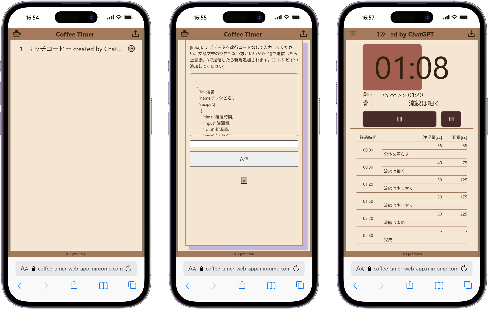

## Service Overview

This is a web app where you can see your hand-drip coffee recipe and timer on one screen.
The timer uses a bar, not numbers, so you can feel the progress at a glance, even while watching the dripper.

## Why I Made This

I joined the Akashi College Coffee Club and started hand-drip coffee.
Managing the recipe, timer, and scale all in different places, while also watching the dripper, was harder than I thought. I wanted one tool that could do it all on one screen, so I built this app.

A coffee scale (a tool that measures weight and time together) was hard to buy at the time, so I used a normal kitchen scale and a timer instead.
Thanks to this app, I've enjoyed coffee for two years without buying a scale.
A senior member of the coffee club told me, "This app is amazing," which made me really happy.

## Why I Chose These Technologies

### Next.js + TypeScript
I had used the Pages Router before, but this was my first time using the App Router.
I was already used to Next.js, and it also works well with Vercel deploys.

### localStorage
I planned to build this app in one night (with late-night energy), so I chose a setup with no backend.
I saved settings by writing JSON straight to localStorage.
I only needed to save the coffee recipe settings, so this was enough for this app.

## What I Cared About Most

I spent most of my time on showing the timer's progress as a bar, not just numbers.
I wanted users to see the progress visually, without numbers, so they could keep watching the dripper the whole time.

## Problems I Faced

### Learning cost of the App Router
I started coding before I fully understood how `layout.tsx` and `page.tsx` work together (passing data, inheriting layout). This led to bugs from my own misunderstanding, and fixing them took a lot of time — the biggest cost in this one-night project.
