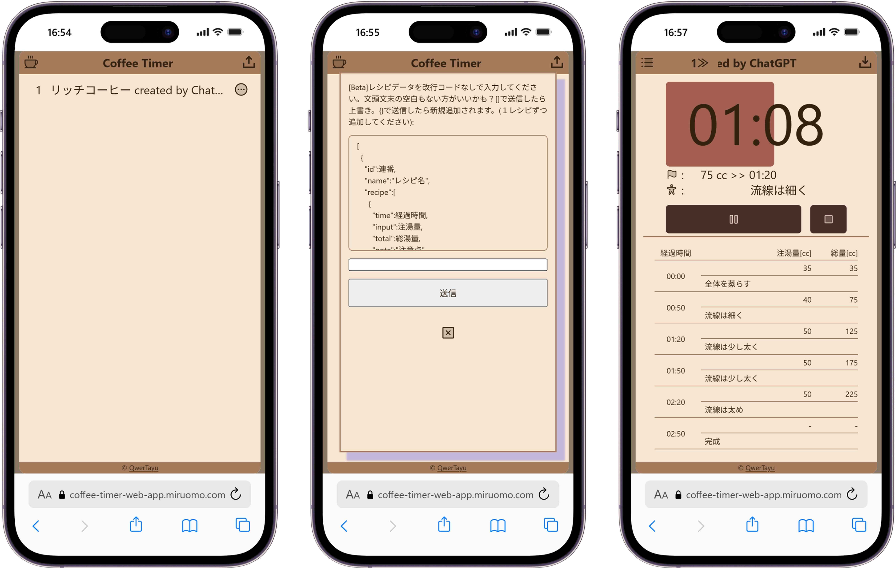

## サービス概要

ハンドドリップコーヒーのレシピとタイマーを一画面で確認できるWebアプリです。
タイマーは数字ではなくインジケータ形式で表示することで、
ドリッパーを注視しながらでも感覚的に進捗を把握できます。

## 開発の思い

明石高専珈琲研究会に入会し、ハンドドリップを始めました。
レシピ・タイマー・スケールをそれぞれ別に管理しながら
ドリッパー内部も確認するのは想像以上に難しく、「一画面で完結するツールがあれば」と感じたことが開発のきっかけです。

コーヒースケール（重量と時間を同時に計れる専用器具）は
当時購入が難しかったため、手持ちのキッチンスケールとタイマーで代用していました。
このアプリを作ることでスケールを買わずに2年間コーヒー生活を楽しんでいます。
珈琲研の先輩から「このアプリすごいね」と声をかけてもらえたことも、自分にとって嬉しい体験でした。

## 技術選定の理由

### Next.js + TypeScript
それまでPages Routerでの開発経験はあったが、
本プロジェクトでApp Routerを初めて採用。
Next.jsの開発環境に慣れていたこと、Vercelへのデプロイ親和性も選定理由のひとつ。

### localStorage
1晩での開発を想定していた(深夜テンション)ため、バックエンドを持たない構成を選択。
設定の永続化にはlocalStorageへのJSON直保存を採用。
保存するのはコーヒーレシピの設定値のみで、このユースケースでは十分と判断しました。

## こだわり

タイマーの進捗をインジケータ形式で視覚化することに最も開発時間を費やしました。
数字だけでなく視覚的な残量表示にすることで、
ドリッパーから目を離さずに操作できるUXを目指しました。

## 開発で直面したこと

### App Router の学習コスト
`layout.tsx` と `page.tsx` の役割分担(データの受け渡し・layoutの継承)を十分に理解しないまま実装を始めたため、
認識の誤りに起因するバグの修正に苦労しました。
1晩開発の中で最もコストがかかった部分です。
