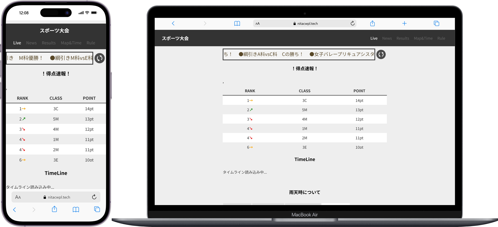

## Service Overview

This is a special site that shares all the information for the Akashi College Sports Festival in one place.
It shows live news with banners, and live score updates linked to a Google Sheet.

The festival was held across many game venues, so this site gave a way to check results from other venues in real time.
I built and ran this as part of the Web Design Club's activities.

An updated 2023 version of this site, built using what we learned in 2022, is [here](https://miruomo.com/?work=sports-2023#works).

## Why I Made This

At a sports festival, games often run late one after another, and since venues are spread out, it's hard to know the results of other games.
I thought, "If we manage all the info on one website, we can solve this," so we built a special site that didn't exist back in 2021.

On the day of the festival, we updated live scores in real time, and people were happy to use it. This was the first time I felt "something I built is really being used."

## Why I Chose These Technologies

### HTML + CSS + JavaScript
We built a simple static site that matched our skills at the time.

### Google Sheets API
We wanted non-engineer members to be able to update the live scores too, so we used a Google Sheet as the data source.
Just updating the sheet would update the site.

## Problems I Faced

### Cost of updating the tournament chart
On the day, we updated the tournament chart in PowerPoint, exported it as an image, and uploaded it to the rental server, every time it changed.
This manual work happened every time a match finished, and it was a heavy load on the day.

### A site crash from editing the server directly
We edited the code directly in the rental server's admin panel, and one time we forgot to close a `div` tag, which broke the whole site.
This is what pushed us to move to version control with GitHub the next year.
