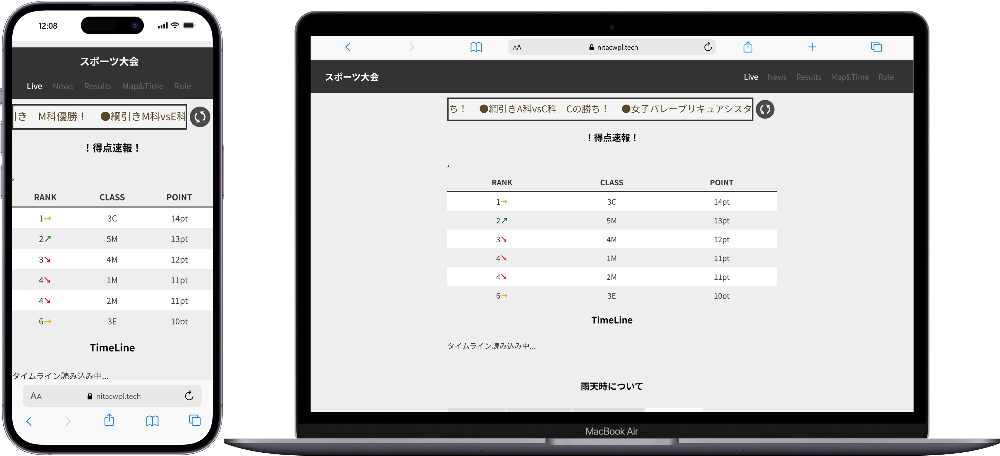

## サービス概要

明石高専スポーツ大会の情報を一元配信する特設サイトです。
お知らせバナーによるリアルタイム告知と、
Google スプレッドシートと連携した得点速報機能を実装しました。

複数の競技会場に分かれた大会で、他会場の結果をリアルタイムに確認できる手段として
Web研究部の活動として開発・運用しました。

2022年度の開発・運用経験を生かしてアップデートされた2023年度版特設サイトが[こちら](https://miruomo.com/?work=sports-2023#works)になります。

## 開発の思い

スポーツ大会では競技間の移動・進行遅延が連鎖的に起きやすく、
また会場が複数に分かれているため他競技の結果を把握しづらいという課題がありました。
「Webサイトで情報を一元管理できれば解決できる」と思い、
2021年には存在しなかった特設サイトを自分たちで立ち上げることにしました。

当日は得点速報をリアルタイムで更新し、参加者から喜んでもらえたことで
「作ったものが実際に使われる」体験を初めて得ることができました。

## 技術選定の理由

### HTML + CSS + JavaScript
当時の自分たちの技術スタックに合わせてシンプルな静的サイトとして構築しました。

### Google Sheets API
得点速報の更新をエンジニア以外のメンバーでも行えるようにするため、
Googleスプレッドシートをデータソースとして採用しました。
スプレッドシートを更新するだけでサイトに反映される仕組みにしています。

## 開発で直面したこと

### トーナメント表の更新コスト
当日のトーナメント表はPowerPointで図を更新するたびに
画像をエクスポートしてレンタルサーバにアップロードする運用でした。
試合が進むたびに手作業が発生し、当日の運用負荷が高かったことが課題として残りました。

### レンサバ直接編集によるサイト障害
コードはレンタルサーバの管理画面上で直接編集していたため、
`div` タグの閉じ忘れによってサイトが崩壊するという障害が発生しました。
この経験が翌年以降にGitHubでのバージョン管理へ移行するきっかけとなりました。
