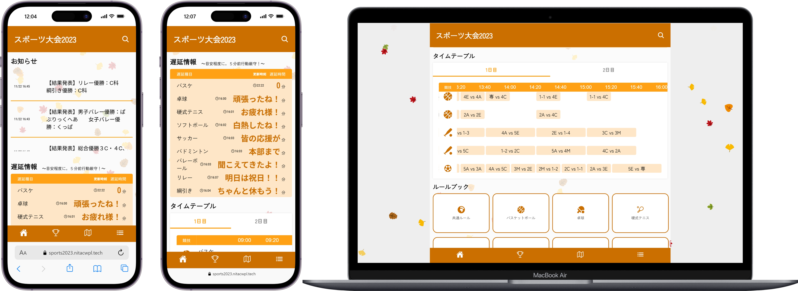
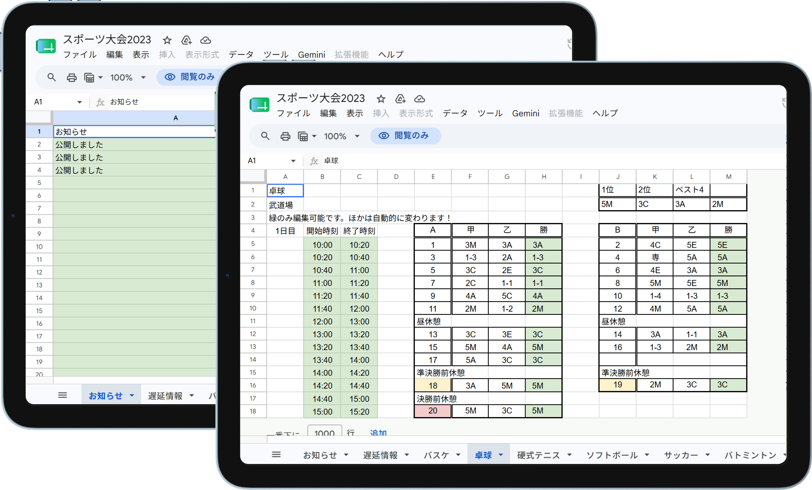

## Service Overview

This is the information site for the Akashi College Sports Festival 2023, built to fix the problems from the 2022 site.
Using a Google Sheet as the data source, it manages live scores, match charts, and the tournament chart all in one place.
Just updating the sheet updates the match chart automatically, and even the "TBD" spots for later matches are replaced with team names automatically.

The 2022 version is [here](https://miruomo.com/?work=sports-2022#works).

## Why I Made This

In the 2022 version, updating the tournament chart by hand in PowerPoint, then exporting and uploading it, was a heavy load every time.
We also had a site crash from editing code directly in the rental server's admin panel, from a missing closing `div` tag.

For the 2023 version, my goal was to fix all of these problems.
I built a system where editing the sheet alone would update both the match chart and the tournament chart automatically, which cut the workload a lot on the day of the event.

## Why I Chose These Technologies

### Astro
At the time, I was leading the effort to bring modern tools into the Web Design Club, and Astro was part of that.
Since Astro lets you write plain HTML, CSS, and JS, it was easy for other members to learn, which made it a good fit for the team.
I also wanted to try using Astro in a real project myself.

### Google Sheets API
Since non-engineer members of the sports festival team update match results and charts, we used a Google Sheet as the data source instead of adding a new CMS — something they already knew how to use.
In the 2023 version, we expanded this so match charts and tournament charts, not just live scores, come from the sheet too. This let non-engineer members handle all the updates on the day by themselves.

## Improvements from the 2022 Version

| Problem (2022) | Fix (2023) |
|---|---|
| Tournament chart updated by hand in PowerPoint, then uploaded | Auto-updates from the sheet |
| Only live scores linked to the sheet | Match chart and tournament chart also come from the sheet |
| Edited directly in the rental server's admin panel | Version control on GitHub, deployed on Vercel |
| Later match opponents stayed as "TBD" | Auto-updates to the team name once decided |
