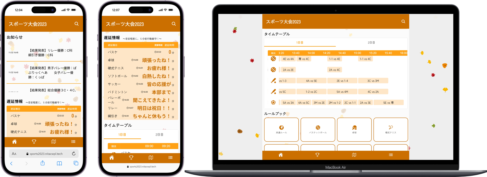
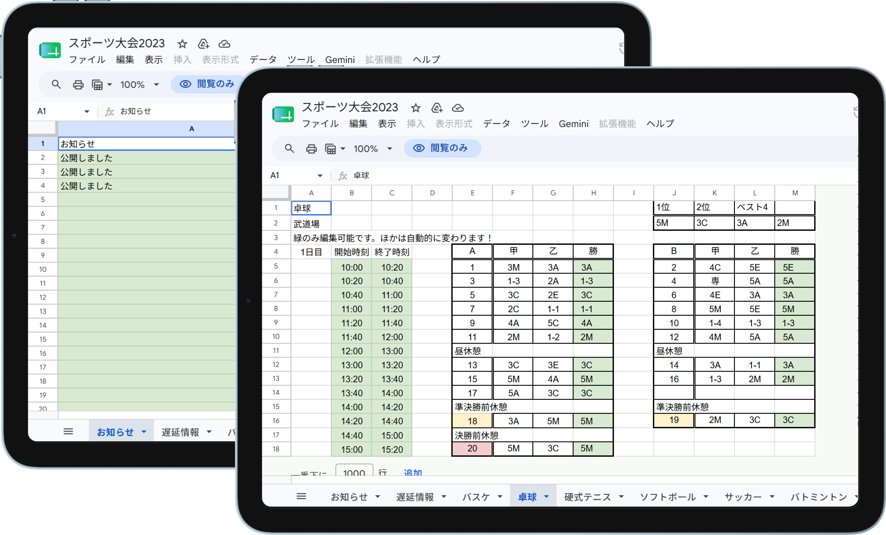

## サービス概要

2022年版特設サイトの課題を解消した、明石高専スポーツ大会2023の情報配信サイトです。
Googleスプレッドシートをデータソースとして、得点速報・対戦表・トーナメント表を一元管理。
スプレッドシートを更新するだけで対戦表が自動反映され、
後半の試合の「未定」欄もチーム名に自動で置き換わる仕組みを実装しました。

2022年版は[こちら](https://miruomo.com/?work=sports-2022#works)。

## 開発の思い

2022年版ではPowerPointでトーナメント表を手作業で更新するたびに画像をエクスポートしてサーバにアップロードするという運用が大きな負荷でした。
また、レンタルサーバの管理画面上で直接コードを編集していたため`div` タグの閉じ忘れによるサイト崩壊も経験しました。

2023年版ではこれらの課題をすべて解消することを目標に設計を見直しました。
スプレッドシートの編集だけで対戦表・トーナメント表まで自動更新される仕組みを作り、当日の運用コストを大幅に削減できました。

## 技術選定の理由

### Astro
Web研にモダンな技術を導入することを当時主導しており、その一環としてAstroを採用しました。
HTML・CSS・JSの記法をそのまま活かせるAstroは、他のメンバーにとっても学習コストが低く、チームへの導入に適していると判断しました。
自分自身もAstroを実プロダクトで使ってみたいという動機もありました。

### Google Sheets API
試合結果や対戦表の更新は非エンジニアのスポーツ大会運営メンバーが行うため、新規にCMSを導入するよりも普段から使い慣れたGoogleスプレッドシートをデータソースとして採用しました。
2023年版では得点速報だけでなく対戦表・トーナメント表もスプレッドシートから配信する設計に拡張し、エンジニア以外のメンバーでも当日の情報更新を完結できる運用を実現しました。

## 2022年版からの改善点

| 課題（2022年） | 改善（2023年） |
|---|---|
| トーナメント表をPowerPointで手作業更新・アップロード | スプシ編集で自動反映 |
| 得点速報のみスプシ連携 | 対戦表・トーナメント表もスプシから配信 |
| レンサバ管理画面で直接編集 | GitHubでバージョン管理・Vercelデプロイ |
| 後半試合の対戦相手が「未定」のまま | 確定次第チーム名に自動更新 |
