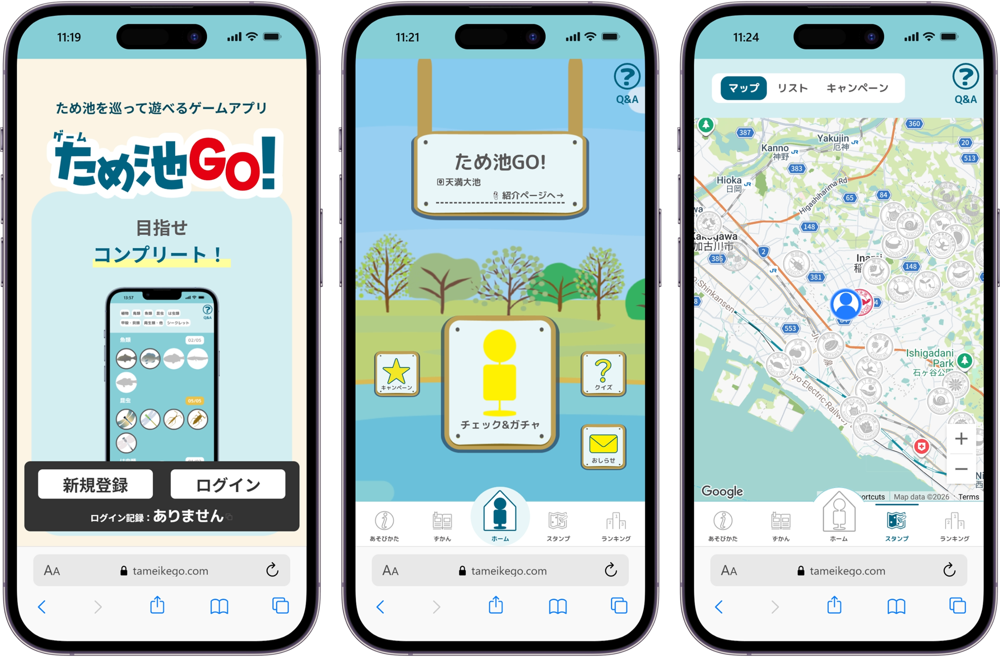
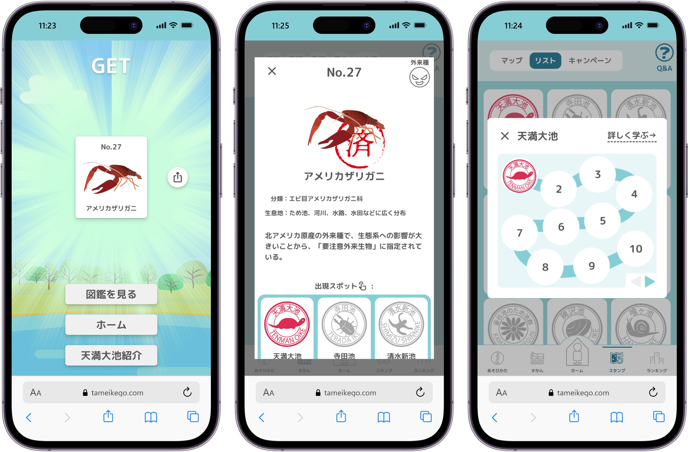

## Service Overview

This is a digital stamp rally web app, made together with the Hyogo Inamino Tameike Museum, for visiting tameike (irrigation ponds) in the Higashi-Harima area.
You scan a QR code at a real pond, and the app checks your location to give you a stamp.
When you check in, you can also play a "creature gacha" to collect creatures that live at that pond. You can learn about the ponds' nature and history through a picture book, a map, and a ranking feature.

Since its release in May 2025, the app has had about 1,000 total users and about 10,000 check-ins.
People from their teens to their 70s use it.

## Why I Made This

In December 2023, our Web Design Club's advisor told me, "Hyogo Prefecture is asking about making a digital stamp rally — are you interested?"
It sounded fun, so in about two days I built a [prototype](https://expo2025-sample-game.miruomo.com/) that only scanned a QR code and checked the location.
People liked it, and I ended up joining meetings held by the prefecture.
From 2024, we brought in more volunteer members, and real development began.

Before this, I had only built things for myself. In this project, I got to plan, build, run, and maintain a product with a real client, over about two years.
I changed features based on user feedback — for example, when I found out many older people used the app, I made the UI simpler and the text bigger. Growing a service that people really use gave me a lot of confidence.

I also had chances outside of just coding: showing the app at Expo 2025 Osaka twice, doing outreach with the Ministry of Agriculture, Forestry and Fisheries, and presenting at the academic event DEIM2026. These were all things this project gave me.

## My Role in the Team

Our team had almost 10 people, and I was the lead engineer.
UI design was led by a student from Akashi College's Architecture department.

- **Design and architecture** — Led the design of the whole system and the database schema
- **Frontend / backend** — Built most of the main features
- **Code review** — Reviewed other members' code and answered technical questions

Team members often asked me to make technical decisions, which gave me a strong sense of responsibility as a lead, and experience teaching others while building.

## Why I Chose These Technologies

### Next.js + TypeScript
I chose this for good mobile display with SSR, and for fast development with React's component style.
Since users type a lot of input, I set up a type-safe environment from the start.

### PostgreSQL + Prisma
In solo projects, I often used NoSQL. But I expected this app to grow large, with complex relations between users, spots, creatures, check-in history, and campaigns. So I chose to try a relational database for the first time.
Since there's a lot of user input, I used Prisma's type-safe query builder instead of writing raw SQL, which removes SQL injection risks by design.

### Jotai (moved from Recoil)
Partway through development, Meta stopped supporting Recoil, so I moved to Jotai.
Its API design was similar, so the move cost very little.

### PWA
I used PWA so users can open the app like a native app from their phone's home screen.
This fit well with how people check in while at the pond.

### QR code + location check
I also thought about the NFC API to stop cheating (getting a stamp without visiting), but iOS browsers don't support it, so I didn't use it.
Instead, I combined QR code scanning with a location check — this keeps costs low while still confirming "the user is really there."

## Design Choices I Care About

### UI/UX for all ages, from kids to seniors
After release, the data showed many older users, so I made the app flow simpler, made the text bigger, and cut down the number of steps.
Reaching users I didn't expect taught me both the challenge and the fun of growing a service that people really use.

### Handling errors at check-in
I mapped out every error that could happen on-site — failed location access, denied permission, a broken URL parameter, a duplicate check-in — in a flowchart, and built a clear message and popup for each one.
I aimed for error messages like "You're too far away" or "You already checked in here," so users know what to do next.

### Rarity design for the gacha
I added rare creatures that only appear at certain ponds, like the aasaza plant, to give people a reason to visit ponds further away.

### Testing with A/B tests
I used DID (difference-in-differences) analysis to check how showing "days left in campaign" and "progress so far" changed user behavior.
The group that saw this information collected their first stamp about 1.5 hours faster, and reached a coupon exchange about 8.5 hours faster, on average.

## Media Coverage / Events

### Media
- [Article: Kobe Shimbun NEXT (Jan 2025)](https://www.kobe-np.co.jp/news/touban/202501/0018522647.shtml) — Learning about pond ecosystems through a game
- [Yahoo News / Article / Radio: Raditopi, Radio Kansai (Jan 2025)](https://jocr.jp/raditopi/2025/01/29/614120/) — Building a game that uses location data
- [Article: Kakogawa Keizai Shimbun (Jun 2025)](https://kakogawa.keizai.biz/headline/2985/) — A digital stamp rally around the Higashi-Harima area
- [YouTube: BAN-BAN TV "Higatan!" (Aug 2025)](https://www.youtube.com/watch?v=Thg2v6STYhw) — Introducing the app while using it
- [Article: Akashi College Official News (Jun 2025)](https://www.akashi.ac.jp/news/20250624kkp001.html) — Report from the Expo Resonance Festival

### Events and Activities
- Osaka-Kansai Expo, "Hyogo Field Pavilion Festival 2025" (May 2025)
- Osaka-Kansai Expo, "Expo Resonance Festival" (Jun 2025)
- Ministry of Agriculture, Forestry and Fisheries outreach event (limited-time access point)
- Presentation at DEIM2026
- Inamino Tameike Rogaining event (Nov 2024, Nov 2025)

*I have permission to list these as work I've done.*
