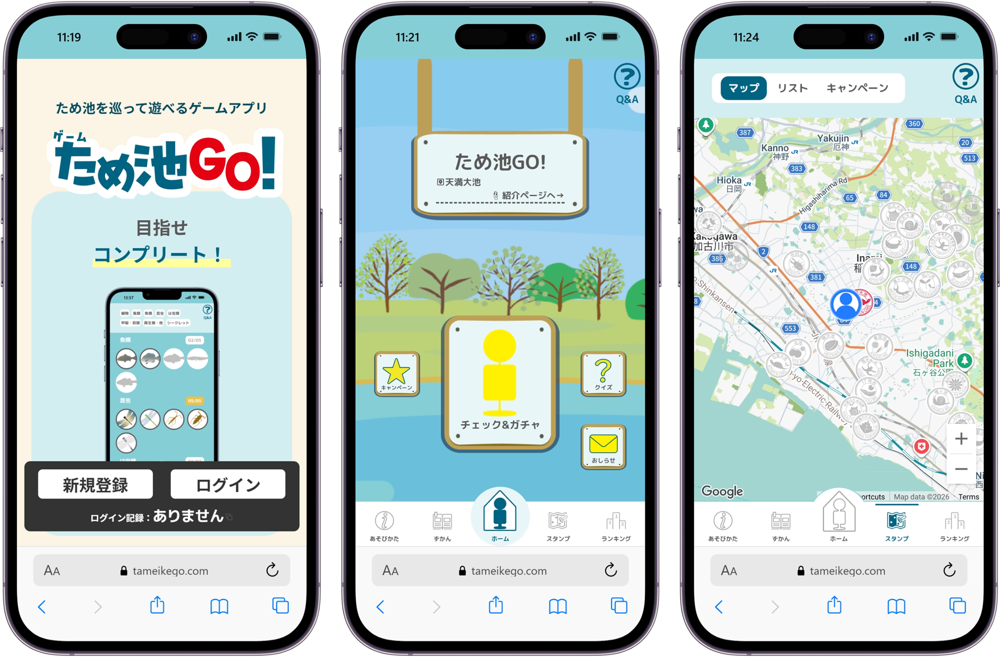
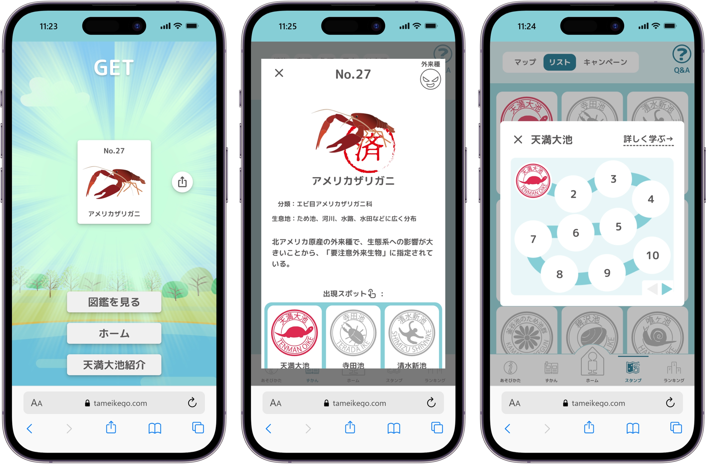

## サービス概要

兵庫県いなみ野ため池ミュージアムと共同開発した、
東播磨地域のため池を巡るデジタルスタンプラリーWebアプリです。
現地に設置されたQRコードを読み込み、位置情報と照合することでスタンプを取得できます。
チェックイン時には「いきものガチャ」でそのため池に生息する生き物を収集でき、
図鑑・マップ・ランキング機能を通じてため池の自然や歴史を学ぶことができます。

2025年5月のリリース以降、累計利用者数は約1,000人・総チェックイン数は約10,000回を記録。
10代以下から70代まで幅広い年代に利用されています。

## 開発の思い

2023年12月、当時のWeb研顧問の先生から
「兵庫県からデジタルスタンプラリー製作の話が来ているが、興味があるか」と声をかけられました。
面白そうだと思い、2日ほどでQRコードを読み込んで位置情報と照合するだけの[プロトタイプ](https://expo2025-sample-game.miruomo.com/)を作成。
反応が良く、そのまま県側で開かれている会議に参加できる流れとなりました。
翌2024年から有志メンバーを追加で募り、本格的な開発がスタートしました。

それまでは自分のためだけのプロダクトしか作ってきませんでしたが、このプロジェクトではクライアントがついた状態での企画・開発・運用・メンテナンスを約2年にわたって経験しました。
ユーザの声を反映して機能を改善し、高齢者の利用が多いとわかったときはUIを簡易化・文字サイズを拡大するなど、実際に使われるサービスを育てる経験が大きな自信となっています。

また、大阪・関西万博への2度の出展、農林水産省での広報活動、学術イベントDEIM2026での発表など、開発の枠を超えた活動の機会を得たことも、このプロジェクトが自分にもたらした大きな収穫です。

## チームと自分の役割

10人弱のチームでの開発で、自分はリードエンジニアを担当しました。
UIデザインは明石高専建築学科の方が主導しました。

- **設計・アーキテクチャ** — システム全体の設計とDBスキーマ設計を主導
- **フロントエンド / バックエンド** — 主要機能の実装を全般にわたって担当
- **コードレビュー** — 他メンバーのコードレビューと技術的な質問への対応

チームメンバーから技術的な方針の判断を求められることが多く、リードとしての責任感と、教えながら進める経験を積みました。

## 技術選定の理由

### Next.js + TypeScript
SSRによるモバイルでの表示最適化と、Reactのコンポーネント指向による開発効率を評価して採用。
ユーザ入力が多いアプリのため、型安全な開発環境を最初から整えました。

### PostgreSQL + Prisma
個人開発ではNoSQLを使うことが多かったが、ユーザ・スポット・いきもの・チェックイン履歴・キャンペーンなど複雑なリレーションを持つ大規模なサービスになることを想定し、初めてRDBMSを採用する技術的挑戦をしました。
ユーザ入力値を扱う箇所が多いため、生のSQLを記述せずPrismaの型安全なクエリビルダーを利用し、SQLインジェクション等の脆弱性を構造的に排除しました。

### Jotai（Recoilからの移行）
開発途中でMetaがRecoilのサポートを終了したため、Jotaiへ移行しました。
APIの設計思想が近く、移行コストを最小限に抑えられた点を評価しました。

### PWA
スマホのホーム画面からアプリのように起動できるUXを実現するために採用。
現地でのチェックイン操作という使われ方に適していると判断しました。

### QRコード + 位置情報照合
不正利用（現地に行かずにスタンプ取得）を防ぐ手段としてNFC APIも検討しましたが、iOSのブラウザでは非対応であったため採用を断念。
QRコード読み取りと位置情報照合を組み合わせることで、コストを抑えながら「実際にその場所にいること」を担保する設計を選択しました。

## こだわり・工夫

### 子供から高齢者まで使えるUI/UX設計
リリース後の利用データから高齢者の利用が多いことが判明し、アプリフローの簡易化・文字サイズの拡大・操作ステップの削減などを実施しました。
想定外のユーザ層にも届いたことで、実際に使われるサービスとして育てる難しさと面白さを学びました。

### チェックイン時の例外処理設計
位置情報の取得失敗・権限拒否・不正なURLパラメータ・重複チェックインなど、現地での操作で発生しうる様々なエラーケースをフローチャートで整理し、それぞれに適切なモーダルとメッセージを実装しました。
「距離が離れています」「チェックイン済みです」など、ユーザが次のアクションを取りやすいエラー表示を意識しました。

### ガチャのレアリティ設計
場所限定の貴重種（アサザなど）を設定することで、
遠方のため池への訪問動機を生み出す設計にしました。

### A/Bテストによる効果検証
キャンペーン残り日数・達成状況の表示施策がユーザ行動に与える影響を
DID（差分の差法）を用いて分析。
施策ありのA群はスタンプ収集までの時間が約1.5時間、
クーポン交換までの時間が約8.5時間短縮される傾向が確認されました。

## メディア掲載 / 出展歴

### メディア
- [【記事】神戸新聞NEXT（2025.01）](https://www.kobe-np.co.jp/news/touban/202501/0018522647.shtml) — ため池の生態系、ゲームで学んで
- [【Yahooニュース掲載・記事・ラジオ】ラジトピ・ラジオ関西（2025.01）](https://jocr.jp/raditopi/2025/01/29/614120/) — 位置情報活用したゲーム開発
- [【記事】加古川経済新聞（2025.06）](https://kakogawa.keizai.biz/headline/2985/) — 東播磨地域を巡るデジタルスタンプラリー
- [【YouTube】BAN-BANテレビ「ひがタン！」（2025.08）](https://www.youtube.com/watch?v=Thg2v6STYhw) — アプリを体験しながら紹介
- [【記事】明石高専 公式ニュース（2025.06）](https://www.akashi.ac.jp/news/20250624kkp001.html) — EXPO共鳴フェス出展報告

### イベント出展・活動
- 大阪・関西万博「ひょうごフィールドパビリオンフェスティバル2025」（2025.05）
- 大阪・関西万博「EXPO共鳴フェス」（2025.06）
- 農林水産省 広報イベント（期間限定アクセスポイント設置）
- DEIM2026 発表
- いなみ野ため池巡りロゲイニング（2024.11、2025.11）

※ 制作実績として掲載する許可を得ています。
