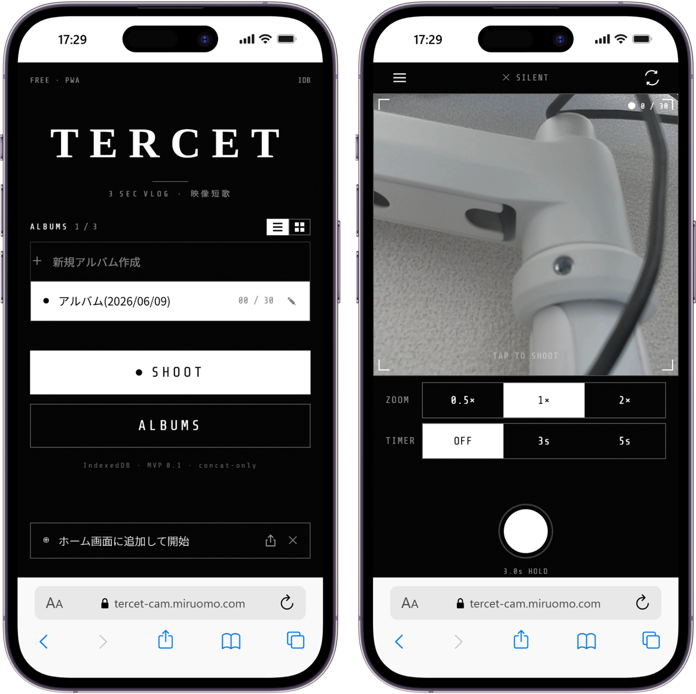

## Service Overview

This is a PWA app that lets you record, cut, and join 3-second videos all in one app.
It removes the trouble of doing three separate steps — record, cut, and join.
The goal is to make a fun, fast-paced daily vlog in just one flow.

> **This app is still in development.**

## Why I Made This

I saw a popular way to make cool vlogs on Threads: just join many 3-second videos together.
I tried it, and the video really did feel fast and fun.
But recording, cutting, and joining videos in different apps was slow and hard to keep up with.
I wanted one app that could do everything, so I started building it.

## Development Flow with Claude

In this project, I used Claude from the design stage all the way to coding.

1. **Requirements and design** — I talked with Claude Chat to define the specs, and saved them in the repo as `docs/要件定義書.md` and `docs/設計仕様書.md`
2. **UI design** — I designed the app screens with Claude Design and saved the exported files in the repo
3. **Making CLAUDE.md** — I gave Claude those documents and asked it to generate CLAUDE.md, then put it in the project root
4. **Coding** — Claude Code read all of this as context before starting to build

Keeping the docs as a "single source of truth" in the repo, so the AI can always check the design intent before coding, was also something I wanted to test with this project.

## Why I Chose These Technologies

### Next.js + TypeScript
I picked a setup I was already used to.
It also works well with PWA and Vercel deploys.

### IndexedDB
I wanted a serverless setup that saves video data right in the browser.
localStorage can't store binary data, so I used IndexedDB instead.

### ffmpeg.wasm
I needed to trim and join videos in the browser, without a server.
By running a WebAssembly version of ffmpeg in the browser, users can edit videos privately, with no upload needed.

## Current Problem

While building this app, I found out about [setlog](https://setlog.app), a service with almost the same idea.
I'm still thinking about how to make TERCET different.
