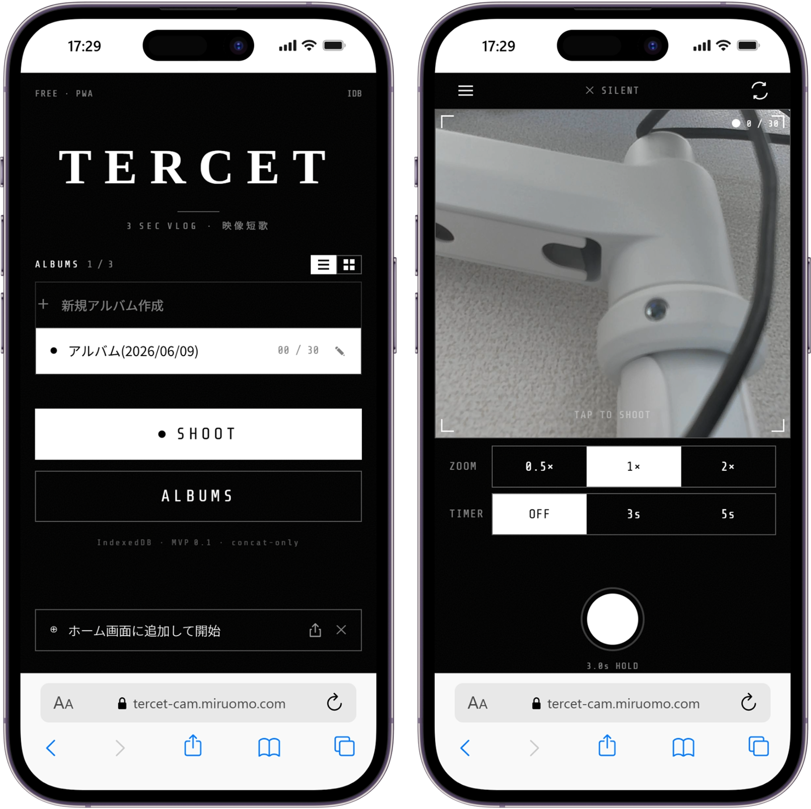

## サービス概要

3秒動画を撮影・結合・保存するまでをアプリ内で完結させるPWAです。
撮影・トリミング・結合という3ステップの煩雑さをなくし、
テンポ感のある日常Vlogをワンフローで作れることを目指しています。

> **現在開発中です。**

## 開発の思い

ThreadsでおしゃれなVlogの撮り方として「3秒動画をつなげるだけ」という
手法を知り、試してみたところたしかにテンポ感のある映像になりました。
ただ、撮影→トリミング→結合の作業が分散していて続けるのが大変で、
一つのアプリ内で完結する手段が欲しいと感じたことが開発のきっかけです。

## Claude を活用した開発フロー

このプロジェクトでは、開発前の設計からコーディングまで一貫してClaudeを活用しました。

1. **要件定義・設計** — Claude Chatで仕様を壁打ちし、`docs/要件定義書.md` と `docs/設計仕様書.md` としてリポジトリに設置
2. **UIデザイン** — Claude Designでアプリ画面を設計し、エクスポートしたファイル群もリポジトリに設置
3. **CLAUDE.md生成** — 上記のドキュメントを参照させてCLAUDE.mdを生成、ルートに設置
4. **実装** — Claude Codeがこれらすべてをコンテキストとして読み取った状態で開発開始

ドキュメントを「単一の真実」としてリポジトリで管理し、
AIが常に設計意図を参照できる環境を整えた上でコーディングに入る、
というワークフローの検証も本プロジェクトの目的のひとつでした。

## 技術選定の理由

### Next.js + TypeScript
これまでの開発で慣れた構成を採用。
PWA対応・Vercelデプロイとの親和性も選定理由のひとつ。

### IndexedDB
動画データをブラウザ内に保存するためサーバーレスで完結する構成を選択。
localStorageでは扱えないバイナリデータの永続化にIndexedDBを採用。

### ffmpeg.wasm
動画のトリミング・結合処理をサーバーサイドなしでブラウザ上で実現するために採用。
WebAssemblyベースのffmpegをブラウザで動かすことで、
アップロード不要のプライベートな動画処理を可能にしました。

## 現在の課題

開発途中でほぼ同様の機能を持つ[setlog](https://setlog.app)の存在を知り、
差別化をどう図るか検討中です。
